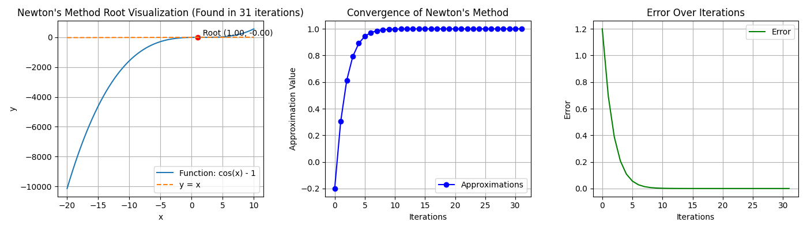

# math-foundations-programming

## It includes the following algorithms and topics:
- Pagerank algorithm with network interpolated node plotting
- Types of approximation
- Gaussian elimination
- Interpolation
    - Cubic Interpolation
    - Linear Interpolation
    - Lagrange Interpolation
- Iteration Methods
    - gaussian iteration
    - Jacobi method
- Minima Maxima
- Prey and Predator algorithm
- Root calculation
    - Bisection
    - Fixed Point
    - Newton's Method

# Examples
## hybrid_solver:

### X0 = -1
### Equation = (x-3)*(x-1)**2

## newtons_method:

#### Function: x**2 - 4

#### Function: cos(x) - 1

## Exercise 1: find_root.py

#### Result: 0.348660945892334
